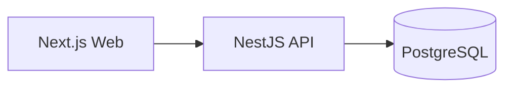

# Target Architecture

**Versao:** 1.0
**Status:** Rascunho | Em Revisao | Aprovada
**Entradas:** `product.md`, `standards-map.md`

## 1. Visao Geral

Resumo em 3 a 6 linhas do sistema alvo, principais fronteiras e estilo arquitetural.

## 2. Stack Escolhida

| Area | Decisao | Fonte nos standards | Racional |
|---|---|---|---|
| Frontend |  |  |  |
| Design system | Ant Design na PoC; design system corporativo em producao quando existir |  |  |
| Backend |  |  |  |
| Banco |  |  |  |
| ORM |  |  |  |
| Auth |  |  |  |

## 3. Diagrama

## 4. Componentes

| Componente | Tipo | Responsabilidade | Contratos |
|---|---|---|---|
|  | Web/API/Service/DB/Shared |  |  |

## 5. Bounded Contexts / Modulos

| Contexto | Responsabilidade | Entidades principais | Justificativa |
|---|---|---|---|
|  |  |  |  |

## 6. Fronteiras

- Frontend -> Backend:
- Backend -> Banco:
- Shared package:
- Configuracao / secrets:

## 7. Auth e Autorizacao

| Perfil | Permissoes | Observacoes |
|---|---|---|
|  |  |  |

## 8. Observabilidade

- Logs:
- Health checks:
- Metricas:
- Traces:

## 9. Boas Praticas de Engenharia Aplicadas

| Area | Decisao | Como sera aplicada | Evidencia esperada |
|---|---|---|---|
| Backend |  |  |  |
| Frontend |  |  |  |
| API |  |  |  |
| Banco de Dados |  |  |  |
| Testes |  |  |  |
| Seguranca |  |  |  |
| Observabilidade |  |  |  |

## 10. Deploy e CI/CD

- Build:
- Testes obrigatorios:
- Variaveis de ambiente:
- Estrategia de deploy:

## 11. Decisoes Arquiteturais

| ID | Decisao | Alternativas descartadas | Racional | Impacto |
|---|---|---|---|---|
| AD-01 |  |  |  |  |

## 12. Riscos e Excecoes

| ID | Risco / excecao | Severidade | Mitigacao |
|---|---|---|---|
|  |  |  |  |
